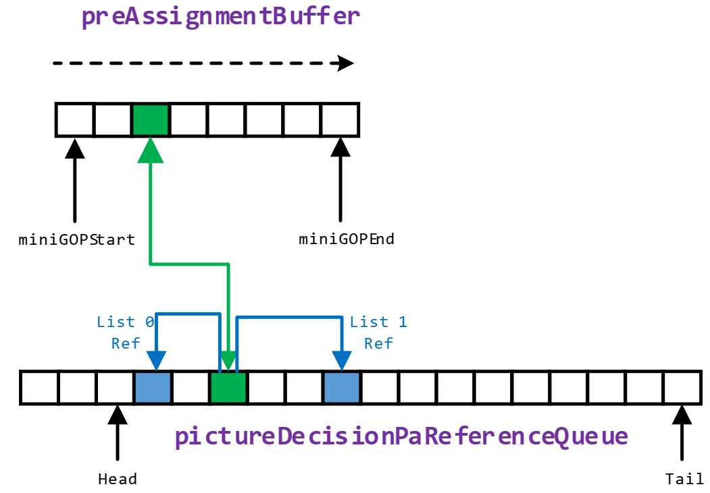
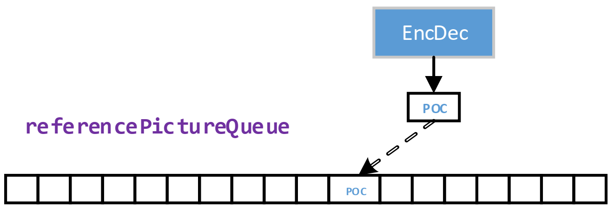

# Notes of SVT-HEVC

(Austin Hu <austin.hu@intel.com>)
## Directory
[1. Call Stacks (as ffmpeg plugin)](#1-call-stacks-as-ffmpeg-plugin)

[2. EbEncHandle_t Managed Objects](#2-ebenchandle_t-managed-objects)

[3. System Resource Management](#3-system-resource-management)

[4. Connection Between Kernel (Thread) and System Resources](#4-connection-between-kernel-thread-and-system-resources)

[5. Execution Flow of an Abstract Kernel (Thread)](#5-execution-flow-of-an-abstract-kernel-thread)

[6. Encoding Pipeline (Kernels or Threads) & Objects Lifecycle](#6-encoding-pipeline-kernels-or-threads--objects-lifecycle)

[7. FIFO Object Flow Through Kernels (Threads) & System Resources](#7-fifo-object-flow-through-kernels-threads--system-resources)

[8. Working Flow of Some Kernels (Threads)](#8-working-flow-of-some-kernels-threads)

[9. FIFO Object Management of Kernels (Threads)](#9-fifo-object-management-of-kernels-threads)

[10. Notes](#10-notes)

[11. To Summarize](#11-to-summarize)

 

---

## 1. Call Stacks (as ffmpeg plugin)

### 1.1 AVCodec.init

**AVCodec.init-\>eb\_enc\_init**-\>

1.  EbInitHandle-\>InitH265EncoderHandle-\>EbEncHandleCtor

    a.  InitThreadManagmentParams

    b.  EbSequenceControlSetInstanceCtor
      - EncodeContextCtor
        - PictureDecisionReorderEntryCtor
        - PictureManagerReorderEntryCtor
        - InputQueueEntryCtor
        - ReferenceQueueEntryCtor
        - PaReferenceQueueEntryCtor
        - InitialRateControlReorderEntryCtor
        - HlRateControlHistogramEntryCtor
        - PacketizationReorderEntryCtor
        - EncodeCabacContextModelCtor
        - MdRateEstimationContextCtor
        - RateControlTablesCtor
      - EbSequenceControlSetCtor

2.  config\_enc\_params

3.  EbH265EncSetParameter-\>

    a.  SetDefaultConfigurationParameters

    b.  CopyApiFromApp

    c.  VerifySettings

    d.  SetParamBasedOnInput

    e.  PredictionStructureGroupCtor-\>PredictionStructureCtor

    f.  LoadDefaultBufferConfigurationSettings

4.  EbInitEncoder

    a.  EbSystemResourceCtor(EbSequenceControlSetCtor)

    b.  EbSystemRuesourceCtor(PictureParentControlSetCtor)

    c.  EbSystemResourceCtor(PictureControlSetCtor)

    d.  EbSystemResourceCtor(EbReferenceObjectCtor)

    e.  EbSystemResourceCtor(EbPaReferenceObjectCtor)

    f.  EbSystemResourceCtor(EbInputBufferHeaderCtor)

    g.  EbSystemResourceCtor(EbOutputBufferHeaderCtor)

    h.  EbSystemResourceCtor(EbOutputReconBufferHeaderCtor)

    i.  EbSystemResourceCtor(ResourceCoordinationResultCtor)

    j.  EbSystemResourceCtor(PictureAnalysisResultCtor)

    k.  EbSystemResourceCtor(PictureDecisionResultCtor)

    l.  EbSystemResourceCtor(MotionEstimationResultsCtor)

    m.  EbSystemResourceCtor(InitialRateControlResultsCtor)

    n.  EbSystemResourceCtor(PictureResultsCtor)

    o.  EbSystemResourceCtor(RateControlTasksCtor)

    p.  EbSystemResourceCtor(RateControlResultsCtor)

    q.  EbSystemResourceCtor(EncDecTasksCtor)

    r.  EbSystemResourceCtor(EncDecResultsCtor)

    s.  EbSystemResourceCtor(EntropyCodingResultsCtor)

    t.  ResourceCoordinationContextCtor

    u.  PictureAnalysisContextCtor

    v.  PictureDecisionContextCtor

    w.  MotionEstimationContextCtor

    x.  InitialRateControlContextCtor

    y.  SourceBasedOperationsContextCtor

    z.  PictureManagerContextCtor

    aa.  RateControlContextCtor

    bb.  ModeDecisionConfigurationContextCtor

    cc.  EncDecContextCtor

    dd.  EntropyCodingContextCtor

    ee.  PacketizationContextCtor

    ff.  EbSetThreadManagementParameters

    gg.  EB\_CREATETHREAD(ResourceCoordinationKernel)

    hh.  EB\_CREATETHREAD(PictureAnalysisKernel)

    ii.  EB\_CREATETHREAD(PictureDecisionKernel)

    jj.  EB\_CREATETHREAD(MotionEstimationKernel)

    kk.  EB\_CREATETHREAD(InitialRateControlKernel)

    ll.  EB\_CREATETHREAD(SourceBasedOperationsKernel)

    mm.  EB\_CREATETHREAD(PictureManagerKernel)

    nn.  EB\_CREATETHREAD(RateControlKernel)

    oo.  EB\_CREATETHREAD(ModeDecisionConfigurationKernel)

    pp.  EB\_CREATETHREAD(EncDecKernel)

    qq.  EB\_CREATETHREAD(EntropyCodingKernel)

    rr.  EB\_CREATETHREAD(PacketizationKernel)

5.  EbH265EncStreamHeader

    a.  OutputBitstreamUnitCtor

    b.  ResetBitstream-\> OutputBitstreamReset

    c.  EncodeAUD

    d.  ComputeProfileTierLevelInfo

    e.  ComputeMaxDpbBuffer

    f.  EncodeVPS

    g.  EncodeSPS

    h.  EncodePPS

    i.  FlushBitstream

    j.  CopyRbspBitstreamToPayload

### 1.2 AVCodec.send\_frame

**AVCodec.send\_frame-\>eb\_send\_frame**-\>EbH265EncSendPicture-\>

1.  EbGetEmptyObject

2.  CopyInputBuffer-\>
    a.  CopyFrameBuffer
    b.  CopyUserSei

3.  EbPostFullObject

### 1.3 AVCodec.receive\_packet

**AVCodec.receive\_packet-\>eb\_receive\_packet**-\>

1.  EbH265GetPacket-\>EbGetFullObjectNonBlocking or EbGetFullObject

2.  ff\_alloc\_packet2

3.  EbH265ReleaseOutBuffer

 

---

## 2. EbEncHandle\_t Managed Objects

- Encode Instances & Compute Segments

- Sequence Control

- Picture Control, Picture Parent Control

- Pools (reconPicture, coeffPicture, referencePicture, referencePictureProducer)

- Threads & Contexts (resourceCoordination, pictureEnhancement, pictureAnalysis, pictureDecision, motionEstimation, initialRateControl, sourceBasedOperations, pictureManager, rateControl, modeDecisionConfiguration, encDec, entropyCoding, packetization)

- System Resource Managers (inputBuffer, outputStreamBuffer, outputReconBuffer, resourceCoordinationResults, pictureAnalysisResults, pictureDecisionResults, motionEstimationResults, initialRateControlResults, pictureDemuxResults, rateControlTasks, rateControlResults, encDecTasks, encDecResults, entropyCodingResults)

- Inter-Process Producer/Consumer FIFOs (inputBuffer, outputStreamBuffer, outputReconBuffer, resourceCoordinationResults, pictureAnalysisResults, pictureDecisionResults, motionEstimationResults, initialRateControlResults, pictureDemuxResults, pictureManagerResults, rateControlTasks, rateControlResults, encDecTasks, encDecResults, entropyCodingResults)

- Callbacks

- Input Video Ports, Output Bitstream Port

 

---

## 3. System Resource Management
### 3.1 Overview

 

**Note**: all EbObjectWrapper\_t objects are in the emptyQueue when creating a System Resource object. And each of them would be queued from emptyQueue, and enqueued to fullQueue once it's updated by producer.

### 3.2 Key Functions of System Resource Management

-   **EbGetEmptyObject**: dequeue an EbObjectWrapper\_t object from one specific EbFifo\_t object of emptyQueue in System resource.

-   **EbPostFullObject**: queue an EbObjectWrapper\_t object into the (tail of) fullQueue (objectQueue) of a System Resource, and assign available EbObjectWrapper\_t objects with each corresponding EbFifo\_t object. *(Queue into the tail, to make sure EbGetFullObject() gets the oldest object)*

-   **EbGetFullObject**: dequeue an EbObjectWrapper\_t object from (head of) one specific EbFifo\_t object of fullQueue in System resource.

-   **EbReleaseObject**: once an EbObjectWrapper\_t object live count is 0, queue it into the (head of) emptyQueue (objectQueue) of a System Resource, and assign available EbObjectWrapper\_t objects with each corresponding EbFifo\_t object. *(Queue into the head, to increase the cache hit rate)*

-   **EbMuxingQueueAssignation**: (in an EbMuxingQueue\_t object,) dequeue an EbObjectWrapper\_t object from non-empty objectQueue, meanwhile an EbFifo\_t object from non-empty processQueue, and queue (assign) the EbObjectWrapper\_t object into that EbFifo\_t object. Until either the objectQueue or processQueue is empty. Typically it's invoked once the EbObjectWrapper\_t object needs to be consumed or produced in the following step.

### 3.3 Procedure of Creating a System Resource object

 

---

## 4. Connection Between Kernel (Thread) and System Resources

 

---

## 5. Execution Flow of an Abstract Kernel (Thread)

Here're the steps of execution flow of a kernel (thread) which consumes objects in System Resource 1 and produce objects in System Resource 2:

 

---

## 6. Encoding Pipeline (Kernels or Threads) & Objects Lifecycle

 

With PR \#[475](https://github.com/OpenVisualCloud/SVT-HEVC/pull/475/) applied:

 

---

## 7. FIFO Object Flow Through Kernels (Threads) & System Resources
### 7.1 More Detailed Encoding Pipeline

 

**Note:**

1.  Normally, an object consumed by a kernel, will be released to its System Resource at the end of (CU, or LCU or picture) execution of that kernel;

2.  The object consumed by Resource Coordination kernel, will be released (to the empty queue of "Input Buffer" System Resource) by Rate Control kernel after receiving RC\_PACKETIZATION\_FEEDBACK\_RESULT from Packetization kernel;

### 7.2 Other (Global) System Resources used by Kernels (Threads)

#### 7.2.1 Sequence Control Set, Picture Parent Control Set, Picture Control Set

 

#### 7.2.2 Reference Picture, PA Reference Picture (used by Picture Analysis)

 

**Note:**

1.  The PARef objects (mounted on each PPCS object) generated by EbPaReferenceObjectCtor are derived from the Input buffer in the PA stage, and used to encode the frame (such as the MotionEstimation kernel).

2.  The PicReference objects (mounted on each PPCS/CPCS object) generated by EbReferenceObjectCtor, are derived from the reconstructed frame generated in EncDec kernel, when the frame is referenced by other frames.

 

---

## 8. Working Flow of Some Kernels (Threads)
### 8.1 Picture Decision

*In the SVT-HEVC code, the GOP structure is constructed in the Picture Decision process which performs multi-picture level decisions, including setting the prediction structure, setting the picture type, and scene change detection. Since the prior Picture Analysis processes stage is multithreaded, inputs to the Picture Decision Process can arrive out-of-display-order, so a reordering queue is used to enforce processing of pictures in display order. The algorithms employed in the Picture Decision process are dependent on prior pictures\' statistics, so the order in which pictures are processed must be strictly enforced. Additionally, the Picture Decision process uses the reorder queue to hold input pictures until they are ready to be sent to the Motion Analysis process, following the proper prediction structure.*

**Kernel Steps:**

A.  Insert the picture into pictureDecisionReorderQueue:

 

(**Note**: the Picture Decision Reordering Queue should be parsed in the display order to be able to construct a prediction structure)

B.  Traverse the whole pictureDecisionReorderQueue for each picture entry:
1. Check whether the sliding window is available, and scene change is detected or not:

 

2. Once the sliding window is available, move the PPCS from pictureDecisionReorderQueue into the Pre-Assignment Buffer (used to store the pictures of a mini-GOP in pre-structure), update the attributes of the PPCS, and clean up its previous PPCS from pictureDecisionReorderQueue:

 

3. Traverse each PPCS entry in the Pre-Assignment Buffer:
 - Update other attributes of them:

 

 - Move each PPCS from the Pre-Assignment Buffer to the tail of pictureDecisionPaReferenceQueue:

 

4. Traverse each PPCS entry in the Pre-Assignment Buffer again:
 - Make sure each PPCS entry exists at the pictureDecisionPaReferenceQueue:

 

 - If the PPCS entry is either P or B frame, by using referenceEntryIndex and referenceList of the found entry in pictureDecisionPaReferenceQueue, calculate the paReferenceQueueIndex of pictureDecisionPaReferenceQueue, to get the referenced picture(s) in pictureDecisionPaReferenceQueue:

 

   So the PPCS entry has the relationship with its referenced picture(s):

 

 - Initialize segment arguments of the PPCS entry, and post each segment of the PPCS to Motion Estimation.

C.  Traverse the entries in pictureDecisionPaReferenceQueue, to try to remove any of them if its dependent picture(s) have completed encoding (in EncDec):

### 8.2 Motion Estimation

#### 8.2.1 Kernel Steps:

A. If the input frame is P or B frame, traverse each LCU of the picture:
1. Copy the data of this LCU from the input picuture to lcuBuffer, quarterLcuBuffer and sixteenthLcuBuffer
2. -\>MotionEstimateLcu:
   - Uni-Prediction motion estimation loop (iterate through the reference frames of List 0/1):
     - If temporal layer \> 0, or there is a forward reference frame:
       - -\>TestSearchAreaBounds
       - HME: Level0 search: -\>EbHevcHmeOneQuadrantLevel0, EbHevcHmeLevel0
       - HME: Level1 search: -\>EbHevcHmeLevel1
       - HME: Level2 search: -\>EbHevcHmeLevel2
       - HME - Search Center
     - -\>EbHevcCheckZeroZeroCenter
     - Calculate the coordinates of the Search Area (xSearchAreaOrigin, ySearchAreaOrigin, searchAreaWidth, searchAreaHeight)
     - Locate integerBufferPtr in bufferY of reference picture by the coordinates of Search Area
     - Initialize pLcuBestSad and assign it to each pBestSad of ME Context. Point each pBestMV to each buffer of pLcuBestMV, and point each pBestSsd to each buffer of pLcuBestSsd. Invoke the call stack of FullPelSearch\_LCU-\>GetEightHorizontalSearchPointResultsAll85PUs\_funcPtrArray-\>GetEightHorizontalSearchPointResultsAll85PUs\_C-\>GetEightHorizontalSearchPointResults\_32x32\_64x64 (pLcuBestMV is calculated in GetEightHorizontalSearchPointResults\_32x32\_64x64)
     - Decide whether to enable subsequent refinement of HalfPel / QuarterPel
     - If either HalfPel / QuarterPel is enabled:
       - Interpolate the search region for Half-Pel Refinements: -\>EbHevcInterpolateSearchRegionAVC
       - Half-Pel Refinement:
         - -\> EbHevcHalfPelSearch\_LCU
         - -\> PU\_HalfPelRefinement
       - Quarter-Pel Refinement:
         - -\> QuarterPelSearch\_LCU
         - If fractionalSearch64x64 is enabled, -\> SetQuarterPelRefinementInputsOnTheFly, -\> PU\_QuarterPelRefinementOnTheFly

   - Bi-Prediction motion estimation loop:
     - If there is a backward reference frame, -\> EbHevcBiPredictionSearch
     - Update pLcuBestMV of ME Context to meResults of PPCS

B. For each LCU of the picture:
1. -\> OpenLoopIntraSearchLcu
2. Similar Collocated Checks + Stationary Edge Over Time Check

C. If LAD\> 0 and the current frame is not the first frame, call ComputeDecimatedZzSad for ZZ SADs Computation

D. For each LCU, calculate ME Distortion and OIS Historgrams

#### 8.2.2 Some steps to calculate SAD, and refine best SAD & MV:

**FullPelSearch\_LCU:**

A. GetEightHorizontalSearchPointResultsAll85PUs\_funcPtrArray (C implementation)
1. GetEightHorizontalSearchPointResults\_8x8\_16x16\_PU
   - Subsad8x8(src = 0xFF, ref = 0x00) -\> sad8x8\_0 = sad8x8\_1 = sad8x8\_2 = sad8x8\_3 = 0xFF \* 8 \* 4 = 0x1FE
   - -\> sad16x16\[0\~7\] = sad16x16\[1\~15\] = ... = sad16x16\[120\~127\] = 0x1FE \* 4 = 0x7F80
2. GetEightHorizontalSearchPointResults\_32x32\_64x64
   - -\> sad32x32\_0 = sad32x32\_1 = sad32x32\_2 = sad32x32\_3 = 0x7F80 \* 4 = 0x1FE00
   - -\> sad64x64 = 0x1FE00 \* 4 = 0x7F800
   - -\> pBestSad64x64 = 0x7F800 \* 2 = 0xFF000

B. GetSearchPointResults (Almost the same steps with Step A.)

### 8.3 Initial Rate Control

**Kernel Steps:**

A. Insert the picture into initialRateControlReorderQueue:

 

B. Traverse the whole initialRateControlReorderQueue for each picture entry from head (if the sliding window starting at the current picture entry is available):
1. Check whether the sliding window is available, if all the picture entries are valid within it, until the Look Ahead Distance is reached:

 

2. Once the sliding window is available:
   - Get intra frame statistics within the sliding window, Update life count for Histogram Queue Entry and other stuffs.
   - Dequeue a reference picture object and assign it to the current picture entry (PPCS object) of the initialRateControlReorderQueue.

### 8.4 Picture Manager

**Kernel Steps:**

A. Update the entries of pictureManagerReorderQueue, inputPictureQueue and referencePictureQueue:
- EB\_PIC\_INPUT (Receives out-of-order picture from previous Source Based Operations):
  1. Insert the picture into pictureManagerReorderQueue:

 

  2. Traverse the whole pictureManagerReorderQueue for each picture entry:
    1.  If the picture of current entry is I-frame, then minus the dependent count with 1 and clean up dependent list of the entry (which the picture depends on) in referencePictureQueue:

 

    2.  Insert the picture into the tail entry of inputPictureQueue:

 

    3.  Initialize the tail entry of referencePictureQueue, even if the picture will not be referenced:

 

- EB\_PIC\_REFERENCE (Get the encoded picture feedback from EncDec):
  Traverse the entries stored in referencePictureQueue, to find out the one with the same POC of the feedback picture from EncDec, and mark the entry as reference available (referenceAvailable = TRUE), so that it can be referenced by other pictures:

 

- EB\_PIC\_FEEDBACK (Get the feedback from Packetization):
  Traverse the entries stored in referencePictureQueue, to find out the one with the same POC of the feedback picture from Packetization, and mark the entry as feedback arrived (feedbackArrived = TRUE):

 

(**Note**: referenceAvailable and feedbackArrived are used to control the availabilityFlag in the entry of referencePictureQueue, to decide whether any latter picture referencing to it (and another entry) can go ahead with its own encoding process, or has to wait in the inputPictureQueue.)

B.  Handle all the entries in inputPictureQueue:
1. Find out the ones whose referencing picture(s) are available:

 

2. Dequeue a PCS object as a child PCS of the entry from the PCS FIFO.
3. Configure Tile Group, Segmentation and LCU information for the PCS, to prepare the parameters for latter EncDec and EntropyCoding;
4. Link the PCS with its referenced entries of referencePictureQueue:

 

5. Post the PCS to the latter Rate Control kernel.

C.  Traverse the entries in referencePictureQueue, to try to remove any of them if its dependent picture(s) have completed encoding (in EncDec):

 

---

## 9. FIFO Object Management of Kernels (Threads)

  | **Kernel** | **Obj Type**   |   **Obj Level** | **Count per Frame**  |  **Notes** |
  | --- | --- | --- | --- | --- |
  | **RC**    |  SCS             |   Frame         |  1          |            |
  |           |  PPCS            |   Frame         |  1          |            |
  |           |  PA\_Ref         |   Frame         |  1          |            |
  |           |  RC\_Result      |   Frame         |  1          |            |
  | **PA**    |  PA\_Result      |   Frame         |  1          |            |
  | **PD**    |  PD\_Result      |   Segment       |  miniGOP\_size * meSegmentsTotalCount | Handles frames in group of miniGOP size, and dequeues PD\_Result objects based on segment level |
  | **ME**    |  ME\_Result      |   Segment       |  meSegmentsTotalCount   |
  | **IRC**   |  Ref\_Pic        |   Frame         |  1          | Based on frame level (after receiving all segments) |
  |           |  Output          |   Frame         |  1          | Based on frame level (after receiving all segments) |
  |           |  IRC\_Result     |   Frame         |  LookAheadDistance | Handles frames in group of LookAheadDistance as sliding window |
  | **SBO**   |  PicDemux\_Result|   Frame         |  1          |            |
  | **PM**    |   CPCS           |   Frame         |  1          |            |
  |           |  PM\_Result      |   Frame         |  1          |            |
  | **RCtrl** |  RC\_Result      |   Frame         |  1          |            |
  | **MDC**   |  MDC\_Result     |   Tile Group    |  tileGroupRowCnt * tileGroupColCnt | |
  | **EncDec**|  Feedback\_Task  |   ?             |  ?          |            |
  |           |  encDec\_Result  |   LCU Line per Tile |  picLcuInHeight * tileColCount | Dequeues encDec\_Result based on LCU line of each tile |
  |           |  PicDemux\_Result|   Frame         |  1          | Handles other stuff (such as SAO) for the reconstructed frame based on frame level |
  | **EC**    |  RC\_Result      |   LCU Line per Tile |  picLcuInHeight * tileColCount | Dequeues RC\_Result based on LCU line of each tile |
  |           |  RC\_Task        |   Frame         |  1          |            |
  | **PK**    |   RC\_Task       |   Frame         |  1          |            |

**Note**: the Object Types marked with Green, are the global ones which are shared among several kernel stages, or even the whole encoding pipeline.

 

---

## 10. Notes

1.  The software architecture of SVT-HEVC and its most implementation are similar with SVT-VP9 & SVT-AV1.

2.  An outputFifo (full FIFO/Queue of a System Resource) may be not used by certain objects (e.g. SequenceControlSet, PictureControlSet, Picture Descriptors, etc.).

3.  Since the prior Picture Analysis processes stage is multithreaded, inputs to the Picture Decision Process can arrive out-of-display-order, so a reordering queue is used to enforce processing of pictures in display order.

4.  The (full) input buffer object dequeued by Resource Coordination, will be released (queue) to the emptyQueue of "Input Buffer" System Resource by Rate Control, after getting the feedback from Packetization.

5.  OutputBitstreamWrite & OutputBitstreamWriteByte:

 

6.  Prediction Structure:

    - threeLevelHierarchicalPredStruct: An array with each entry representing corresponding picture information (through displaying order) in a GOP.

    - PredictionStructureConfigArray: contains level 0\~6 prediction structure configurations (including threeLevelHierarchicalPredStruct, etc.).

7.  PictureControlSet\_t & PictureParentControlSet\_t:

> // Add the concept of PictureParentControlSet which is a subset of the old PictureControlSet.
>
> // It actually holds only high level Pciture based control data:(GOP management,when to start a picture, when to release the PCS, \....).
>
> // The regular PictureControlSet(Child) will be dedicated to store LCU based encoding results and information.
>
> // Parent is created before the Child, and continue to live more. Child PCS only lives the exact time needed to encode the picture: from ME to EC/ALF.

-   **PictureControlSet\_t:** only dequeued (created) in PictureManager kernel once it's ready (already got reference picture(s) from EncDec feedback) to be encoded.

-   **PictureParentControlSet\_t:** it's created in ResourceCoordination and its life cycle goes through the whole encoding pipeline. It's enhancedPicturePtr points to the YUV pixel buffers.

8.  The input buffer sent from EbH265EncSendPicture() is released in RateControl. The output buffer posted by Packetization should be released by EbH265ReleaseOutBuffer() invoked from application.

 

---

## 11. To Summarize

**Rate Control**: handles the input or feedback from Picture Manager, Entropy Coding or Packetization:
-   Input from Picture Manager:

    a.  **High Level**: rate control for the 1^st^ frame;

    b.  **Frame Level**: update pictureQp of the PCS object, for CQP, VBR or CRF mode separately, and assign it to the one of PPCS object;

    c.  **LCU Level**: assign the pictureQp of the PCS object, to QP of each LCU of the frame;

-   Feedback from Entropy Coding: *do nothing*

-   Feedback from Packetization:

    a.  (Frame Level) Update maxRateAdjustDeltaQP or RC context;

    b.  Or update RC interval parameter and the one of previous GOP;

    c.  Release SCS, PPCS and the input buffer (to "Input Buffer" SR).

**Picture Decision**:

-   About RPS (Reference Prediction Structure): refer to the "Notes on the Picture Decision" in EbPictureDecisionProcess.c.

 

---

## Legal Disclaimer

Optimization Notice: Intel compilers may or may not optimize to the same degree for non-Intel microprocessors for optimizations that are not unique to Intel microprocessors. These optimizations include SSE2, SSE3, and SSSE3 instruction sets and other optimizations. Intel does not guarantee the availability, functionality, or effectiveness of any optimization on microprocessors not manufactured by Intel. Microprocessor-dependent optimizations in this product are intended for use with Intel microprocessors. Certain optimizations not specific to Intel microarchitecture are reserved for Intel microprocessors. Please refer to the applicable product User and Reference Guides for more information regarding the specific instruction sets covered by this notice.

Notice Revision #20110804

Intel technologies features and benefits depend on system configuration and may require enabled hardware, software or service activation. Performance varies depending on system configuration. No computer system can be absolutely secure. Check with your system manufacturer or retailer.

No license (express or implied, by estoppel or otherwise) to any intellectual property rights is granted by this document.

Intel disclaims all express and implied warranties, including without limitation, the implied warranties of merchantability, fitness for a particular purpose, and non-infringement, as well as any warranty arising from course of performance, course of dealing, or usage in trade.

The products and services described may contain defects or errors known as errata which may cause deviations from published specifications. Current characterized errata are available on request.  ** ** No product or component can be absolutely secure.

This document contains information on products, services and/or processes in development.  All information provided here is subject to change without notice. Contact your Intel representative to obtain the latest forecast, schedule, specifications and roadmaps.

Intel, Intel Xeon, Intel Core, the Intel logo and others are trademarks of Intel Corporation and its subsidiaries in the U.S. and/or other countries.

\*Other names and brands may be claimed as the property of others.

Copyright 2020 Intel Corporation.
