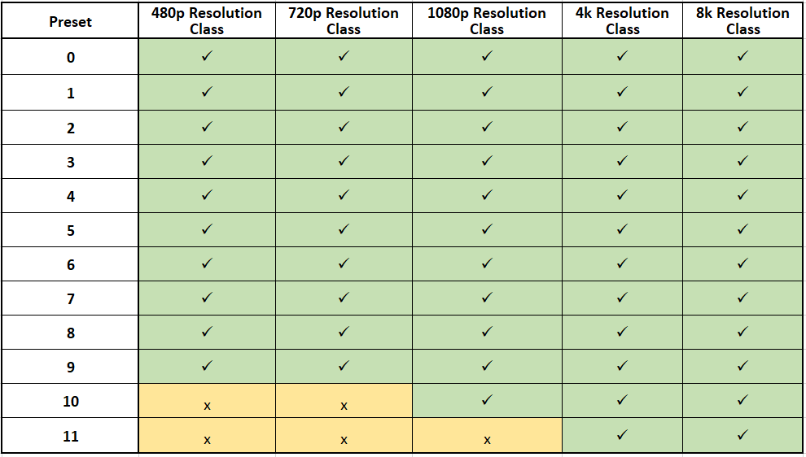
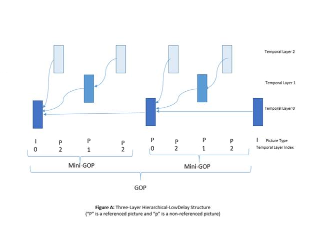

  

# Scalable Video Technology for HEVC Encoder (SVT-HEVC Encoder) User Guide

## Table of Contents
1. [Introduction](#introduction)
2. [System Requirements](#system-requirements)
    - 2.1 [CPU requirements](#cpu-requirements)
    - 2.2 [RAM requirements](#ram-requirements)
    - 2.3 [Operating systems](#operating-systems)
        - 2.3.1 Windows\* Operating Systems (64-bit)
        - 2.3.2 Linux\* Operating Systems (64-bit)
    - 2.4 [Build the code](#build-the-code)
        - 2.4.1 Windows\* Operating Systems (64-bit)
        - 2.4.2 Linux\* Operating Systems (64-bit)
    - 2.5 [Installation](#installation)
3. [ Sample Application Guide](#sample-application-guide)
    - 3.1 [Input Video Format](#input-video-format)
    - 3.2 [Compressed 10-bit format](#compressed-10-bit-format)
        - 3.2.1 [Unpack the 10 bit picture](#unpack-the-10-bit-picture)
        - 3.2.2 [Compress the 2 bit Plane](#compress-the-2-bit-plane)
        - 3.2.3 [Unroll the 64x64](#unroll-the-64x64)
    - 3.3 [Running the encoder](#running-the-encoder)
        - 3.3.1 [List of all configuration parameters](#list-of-all-configuration-parameters)
    - 3.4 [Encoding presets table](#encoding-presets-table)
4. [Best Known Configurations (BKC)](#best-known-configurations-bkc)
    - 4.1 [Hardware BKC](#hardware-bkc)
    - 4.2 [Software BKC](#software-bkc)
        - 4.2.1 [10 bit Input YUV](#10-bit-input-yuv)
        - 4.2.2 Windows\* OS (Tested on Windows\* Server 2016)
        - 4.2.3 Linux\* OS (Tested on Ubuntu\* Server 18.04 and 16.04)
        - 4.2.4 [Command line BKC](#command-line-bkc)
5. [Appendix A Encoder Parameters](#appendix-a-encoder-parameters)
    - 5.1 [Hierarchical coding structure parameters](#hierarchical-coding-structure-parameters)
    - 5.2 [Thread management parameters](#thread-management-parameters)
6. [Legal Disclaimer](#legal-disclaimer)

## Introduction

This document describes the system requirements and how to use the Scalable Video Technology for HEVC Encoder (SVT-HEVC).  In particular, this user guide section describes how to run the sample application with the respective dynamically linked library.

## System Requirements

The SVT-HEVC Encoder library was developed to be supported on x86 for Windows\* and Linux\* operating systems.

### CPU requirements

In order to achieve the performance targeted by the deliverable, the specific CPU model listed in the Readme file would need to be used when running the encoder. Otherwise, the encoder should run on any 5th Generation Intel Core™ Processors (formerly Broadwell) CPUs (for example Xeon E5 v4) or newer, producing the same output.

### RAM requirements

In order to run the highest resolution supported by the encoder, at least 64GB of RAM is required to run a single 8kp60 10-bit encode. The encoder application will display an error if the system does not have enough RAM to support this resolution. The table below lists the minimum amount of RAM required for some standard resolutions of 10bit video per channel:

| **Resolution** | **Minimum Footprint in GB** |
| --- | --- |
| 8k | 64 |
| 4k | 16 |
| 1080p | 6 |
| 720p/1080i | 4 |
| 480p | 3 |

### Operating systems

The list below includes the operating systems that the encoder application and library could run on, assuming the above pre-requisites are met.

#### *Windows\* Operating Systems (64-bit)*

 - Windows\* 10
  - Windows\* Server 2016 Standard

####  *Linux\* Operating Systems (64-bit)*

- Ubuntu\* 16.04 Desktop LTS
- Ubuntu\* 16.04 Server LTS
- Ubuntu\* 18.04 Desktop LTS
- Ubuntu\* 18.04 Server LTS

### Build the code

The list below includes the build tools necessary for the encoder application and library to build properly.

#### *Windows\* Operating Systems (64-bit)*

<u>Build requirements</u>
  - Visual Studio\* 2017
  - YASM Assembler version 1.2.0 or later
    - Download the yasm exe from the following [link](http://www.tortall.net/projects/yasm/releases/yasm-1.3.0-win64.exe)
    - Rename yasm-1.3.0-win64.exe to yasm.exe
    - Copy yasm.exe into a location that is in your system PATH environment variable
  - CMake 3.5 or later [link](https://github.com/Kitware/CMake/releases/download/v3.13.0/cmake-3.13.0-win64-x64.msi)

<u>Build instructions</u>
- Generate the Visual Studio\* 2017 project files by following the steps below in a windows command line prompt:

- In the main repository directory go under the \<repo dir>\Build\windows location
- Run <u>generate\_vs17.bat</u> [such would generate the visual studio project files]
- Open the "<u>svt-hevc.sln</u>" using Visual Studio\* 2017 and click on Build --> Build Solution

- Binaries Location
  - Binaries can be found under <u> \<repo dir\>\Bin/Release or \<repo dir\>\Bin/Debug</u>, depending on whether Debug or Release were selected in the build mode

#### *Linux\* Operating Systems (64-bit)*

<u>Build requirements</u>
  - GCC 5.4.0
  - CMake 3.5.1
  - YASM Assembler version 1.2.0 or later
  
<u>Build instructions</u>
  - In the main repository, run
    - >mkdir build &amp;&amp; cd build &amp;&amp; cmake .. &amp;&amp; make -j \`nproc\` &amp;&amp; sudo make install
- Binaries Location
  - Binaries can be found under Bin/Release

## Installation

For the binaries to operate properly on your system, the following conditions have to be met:

#### *Windows\**:
  - On any of the Windows\* operating systems listed in section 2.3, Install Visual Studio 2017
  - Once the installation is complete, copy the binaries to a location making sure that both the sample application "<u>SvtHevcEncApp.exe</u>" and library "<u>SvtHevcEnc.dll</u>" are in the same folder.
  - Open the command line at the chosen location and run the sample application to encode.
  
#### *Linux\**:
  - On any of the Linux\* operating systems listed in section 2.3, copy the binaries under a location of your choice.
  - Change the permissions on the sample application "<u>SvtHevcEncApp</u>" executable by running the command:
    - >chmod +x SvtHevcEncApp
  - To enable 100% CPU utilization for the real-time <u>SvtHevcEncApp</u>, run the command:
    - >sudo sysctl -w kernel.sched\_rt\_runtime\_us=1000000
  - Open terminal and cd into your directory, then run the sample application to encode

## Sample Application Guide

This section describes how to run the sample encoder application that uses the SVT-HEVC Encoder library.  It describes the input video format, the command line input parameters and the resulting outputs.

### Input Video Format

The SVT-HEVC Encoder supports the following input formats:

8-bit yuv420p
 

 

10-bit yuv420p10le
 

 

### Compressed 10-bit format

In order to reduce the size of the input original YUV file, the SVT-HEVC Encoder uses a compressed 10-bit format allowing the software to achieve a higher speed and channel density levels. The conversion between the 10-bit yuv420p10le and the compressed 10-bit format is a lossless operation and is performed using the following steps.

#### Unpack the 10 bit picture

This step consists of separating the 10 bit video samples into 8 bit and 2 bit planes so that each 10-bit picture will be represented as two separate pictures as shown in the figure below. As a result of the operation, the 2 least significant bits of the 10 bits will be written into a full byte.

 

 
10-bit yuv420p10le unpacked

#### Compress the 2 bit Plane

The unpacking steps separates the 10bits into a group of 8 bits and a group of 2 bits, where the 2 bits are stored in a byte. In this step, every group of consecutive 4 bytes, each containing 2bits from the unpacking step, are compressed into one byte. As a result, each 10bit picture will be represented as two separate pictures as shown in the figure below.

 

#### Unroll the 64x64

Now for a faster read of the samples, every 64x64 block of the 2 bit picture should be written into a one dimensional array. Therefore, the top left 64x64 sample block which is now written into a 16 bytes x 64 bytes after the compression of the 2bit samples, will be written into a 1024 bytes x 1 byte array as shown in the picture below.

 
 

### Running the encoder

This section describes how to run the sample encoder application <u>SvtHevcEncApp.exe</u> (on Windows\*) or <u>SvtHevcEncApp</u> (on Linux\*) from the command line, including descriptions of the most commonly used input parameters and outputs.

The sample application typically takes the following command line parameters:

>-c filename [**Optional**]

A text file that contains encoder parameters such as input file name, quantization parameter etc. Refer to the comments in the Config/Sample.cfg for specific details. The list of encoder parameters are also listed below. Note that command line parameters take precedence over the parameters included in the configuration file when there is a conflict.

>-i filename **[Required]**

A YUV file (e.g. 8 bit 4:2:0 planar) containing the video sequence that will be encoded.  The dimensions of each image are specified by –w and –h as indicated below. Files encoded in YUV4MPEG2 format are also supported (common extension is ".y4m"). The header in YUV4MPEG2 files contains width, height, framerate, and bit-depth information which do not need to be additional specified as command line arguments.

>-b filename **[Optional]**

The resulting encoded bit stream file in binary format. If none specified, no output bit stream will be produced by the encoder.

>-w integer **[Required]**

The width of each input image in units of picture luma pixels,  e.g. 1920

>-h integer **[Required]**]

The height of each input image in units of picture luma pixels,  e.g. 1080

>-n integer **[Optional]**

The number of frames of the sequence to encode.  e.g. 100. If the input frame count is larger than the number of frames in the input video, the encoder will loop back to the first frame when it&#39;s done.

>-intra-period integer **[Optional]**

The intra period defines the interval of frames after which you insert an Intra refresh. It is strongly recommended to use (multiple of 8) -1 the closest to 1 second (e.g. 55, 47, 31, 23 should be used for 60, 50, 30, (24 or 25) respectively)

>-rc integer **[Optional]**

This token sets the bitrate control encoding mode [1: Variable Bitrate, 0: Constant QP]. When rc is set to 1, it&#39;s best to match the –lad (lookahead distance described in the next section) parameter to the -intra-period. When –rc is set to 0, a qp value is expected with the use of the –q command line option otherwise a default value is assigned (25).

>-speed-ctrl integer **[Optional]**

This token sets the encoder to automatically choose the best quality encoding mode that allows the encoder to run at a real-time speed set by the –fps parameter (described in the next section).

>-lp integer **[Optional]**

This token sets the number of logical processors which the encoder threads run on.

>-ss integer **[Optional]**

For dual socket systems, this token specific which socket the encoder runs on.

For example, the following command encodes 100 frames of the YUV video sequence into the bin bit stream file.  The picture is 1920 luma pixels wide and 1080 pixels high using the Sample.cfg configuration. The QP equals 30 and the md5 checksum is not included in the bit stream.

> SvtHevcEncApp.exe -c Sample.cfg -i CrowdRun\_1920x1080.yuv -w 1920 -h 1080 -n 100 -q 30 -intra-period 31 -b CrowdRun\_1920x1080\_qp30.bin

For another example, the following command encodes the complete YUV video sequence, which is stored in a y4m format, into the bin bit stream file. No width, height, or frame rate parameters need to be specified for y4m files.

> SvtHevcEncApp.exe -i akiyo_cif.y4m -b akiyo_cif.bin

It should be noted that not all the encoder parameters present in the Sample.cfg can be changed using the command line.

#### List of all configuration parameters

The encoder parameters present in the Sample.cfg file are listed in this table below along with their status of support, command line parameter and the range of values that the parameters can take.

| **Encoder Parameter as shown in the configuration file** | **Command Line parameter** | **Range** | **Default** | **Description** |
| --- | --- | --- | --- | --- |
| **Channel Number** | -nch | [1 - 6] | 1 | Number of encode instances |
| **ConfigFile** | -c | any string | null | Configuration file path |
| **InputFile** | -i | any string | null | Input file path and name |
| **StreamFile** | -b | any string | null | Output bitstream file path and name |
| **ErrorFile** | -errlog | any string | stderr | Error log displaying configuration or encode errors |
| **ReconFile** | -o | any string | null | Output reconstructed yuv used for debug purposes. **Note:** using this feature will affect the speed of the encoder significantly. This should only be used for debugging purposes. |
| **UseQpFile** | -use-q-file | [0, 1] | 0 | When set to 1, overwrite the picture qp assignment using qp values in QpFile |
| **QpFile** | -qp-file | any string | null | Path to qp file |
| **EncoderMode** | -encMode | [0 - 11] | 7 | A preset defining the quality vs density tradeoff point that the encoding is to be performed at. (e.g. 0 is the highest quality mode, 11 is the highest density mode). Section 3.4 outlines the preset availability per resolution |
| **EncoderBitDepth** | -bit-depth | [8, 10] | 8 | Specifies the bit depth of input video |
| **EncoderColorFormat** | -color-format | [1, 2, 3] | 1 | Specifies the chroma subsampling of input video(1: 420, 2: 422, 3: 444) |
| **CompressedTenBitFormat** | -compressed-ten-bit-format | [0, 1] | 0 | Offline packing of the 2bits: requires two bits packed input (0: OFF, 1: ON) |
| **SourceWidth** | -w | [64 - 8192] | 0 | Input source width |
| **SourceHeight** | -h | [64 - 4320] | 0 | Input source height |
| **FrameToBeEncoded** | -n | [0 - 2^31 -1] | 0 | Number of frames to be encoded, if number of frames is > number of frames in file, the encoder will loop to the beginning and continue the encode. 0 encodes the full clip. |
| **BufferedInput** | -nb | [-1, 1 to 2^31 -1] | -1 | number of frames to preload to the RAM before the start of the encode. If -nb = 100 and –n 1000 --> the encoder will encode the first 100 frames of the video 10 times. Use -1 to not preload any frames. |
| **Profile** | -profile | [1,2] | 2 | 1: Main, 2: Main 10 |
| **Tier** | -tier | [0, 1] | 0 | 0: Main, 1: High |
| **Level** | -level | [1, 2, 2.1,3, 3.1, 4, 4.1, 5, 5.1, 5.2, 6, 6.1, 6.2] | 0 | 0 to 6.2 [0 for auto determine Level] |
| **FrameRate** | -fps | [0 - 2^64 -1] | 25 | If the number is less than 1000, the input frame rate is an integer number between 1 and 60, else the input number is in Q16 format (shifted by 16 bits) [Max allowed is 240 fps]. If FrameRateNumerator and FrameRateDenominator are both !=0 the encoder will ignore this parameter |
| **FrameRateNumerator** | -fps-num | [0 - 2^64 -1] | 0 | Frame rate numerator e.g. 6000When zero, the encoder will use –fps if FrameRateDenominator is also zero, otherwise an error is returned |
| **FrameRateDenominator** | -fps-denom | [0 - 2^64 -1] | 0 | Frame rate denominator e.g. 100When zero, the encoder will use –fps if FrameRateNumerator is also zero, otherwise an error is returned |
| **Injector** | -inj | [0,1] | 0 | Enable injection of input frames at the specified framerate (0: OFF, 1: ON) |
| **InjectorFrameRate** | -inj-frm-rt | [1 - 240] | 60 | Frame Rate used for the injector. Recommended to match the encoder speed. |
| **SpeedControlFlag** | -speed-ctrl | [0,1] | 0 | Enables the Speed Control functionality to achieve the real-time encoding speed defined by –fps. When this parameter is set to 1 it forces –inj to be 1 -inj-frm-rt to be set to the –fps. |
| **InterlacedVideo** | -interlaced-video | [0,1] | 0 | 1 : encoder will signal interlaced signal in the stream  0 : assumes progressive signal |
| **SeparateFields** | -separate-fields | [0,1] | 0 | 1 : Interlaced input, application will separate top and bottom fields and encode it as progressive.  0 : Treat video as progressive video |
| **HierarchicalLevels** | -hierarchical-levels | [0 – 3] | 3 | 0 : Flat 1: 2-Level Hierarchy 2: 3-Level Hierarchy 3: 4-Level Hierarchy Minigop Size = (2^HierarchicalLevels)  (e.g. 3 == > 7B pyramid, 2 ==> 3B Pyramid) Refer to Appendix A.1 |
| **BaseLayerSwitchMode** | -base-layer-switch-mode | [0,1] | 0 | 0 : Use B-frames in the base layer pointing to the same past picture 1 : Use P-frames in the base layer Refer to Appendix A.1 |
| **PredStructure** | -pred-struct | [0 – 2] | 2 | 0: Low Delay P 1: Low Delay B 2: Random Access Refer to Appendix A.1 |
| **IntraPeriod** | -intra-period | [-2 - 255] | -2 | Distance Between Intra Frame inserted.  -1 denotes no intra update.  -2 denotes auto. |
| **IntraRefreshType** | -irefresh-type | [-1,N] | -1 | -1: CRA (Open GOP) >=0: IDR (Closed GOP, N is headers insertion interval, 0 supported if CQP, >=0 supported if VBR) |
| **QP** | -q | [0 - 51] | 25 | Initial quantization parameter for the Intra pictures used when RateControlMode 0 (CQP) |
| **LoopFilterDisable** | -dlf | [0, 1] | 0 | When set to 1 disables the Deblocking Loop Filtering |
| **SAO** | -sao | [0,1] | 1 | When set to 0 the encoder will not use the Sample Adaptive Filter |
| **UseDefaultMeHme** | -use-default-me-hme | [0, 1] | 1 | 0 : Overwrite Default ME HME parameters 1 : Use default ME HME parameters, dependent on width and height |
| **HME** | -hme | [0,1] | 1 | Enable HME, 0 = OFF, 1 = ON |
| **SearchAreaWidth** | -search-w | [1 - 256] | Depends on input resolution | Search Area in Width |
| **SearchAreaHeight** | -search-h | [1 - 256] | Depends on input resolution | Search Area in Height |
| **ConstrainedIntra** | -constrd-intra | [0,1] | 0 | Allow the use of Constrained Intra, when enabled, this features yields to sending two PPSs in the HEVC Elementary streams  0 = OFF, 1 = ON |
| **RateControlMode** | -rc | [0,1] | 0 | 0 : CQP , 1 : VBR |
| **TargetBitRate** | -tbr | Any Number | 7000000 | Target bitrate in bits / second. Only used when RateControlMode is set to 1 |
| **vbvMaxrate** | -vbv-maxrate | Any Number | 0 | VBVMaxrate in bits / second. Only used when RateControlMode is set to 1 |
| **vbvBufsize** | -vbv-bufsize | Any Number | 0 | VBV BufferSize in bits / second. Only used when RateControlMode is set to 1 |
| **vbvBufInit** | -vbv-init | [0 - 100] | 90 | Sets how full the VBV buffer to be|
| **hrdFlag** | -hrd | [0,1] | 0 | HRD Flag, 0 = OFF, 1 = ON |When hrdFlag is set to 1 it requires vbvMaxrate and vbvBufsize to be greater than 0 |
| **MaxQpAllowed** | -max-qp | [0 - 51] | 48 | Maximum QP value allowed for rate control use. Only used when RateControlMode is set to 1. Has to be >= MinQpAllowed |
| **MinQpAllowed** | -min-qp | [0 - 50] | 10 | Minimum QP value allowed for rate control use. Only used when RateControlMode is set to 1. Has to be < MaxQpAllowed |
| **LookAheadDistance** | -lad | [0 - 250] | Depending on BRC mode | When RateControlMode is set to 1 it&#39;s best to set this parameter to be equal to the Intra period value (such is the default set by the encoder), When CQP is chosen, then a (2 \* minigopsize +1) look ahead is recommended. |
| **SceneChangeDetection** | -scd | [0,1] | 1 | Enables or disables the scene change detection algorithm   0 = OFF, 1 = ON |
| **BitRateReduction** | -brr | [0,1] | 1 | Enables visual quality algorithms to reduce the output bitrate with minimal or no subjective visual quality impact.  0 = OFF, 1 = ON |
| **ImproveSharpness** | -sharp | [0,1] | 1 | This is a visual quality knob that allows the use of adaptive quantization within the picture and enables visual quality algorithms that improve the sharpness of the background. This feature is only available for 4k and 8k resolutions   0 = OFF, 1 = ON |
| **VideoUsabilityInfo** | -vid-info | [0,1] | 0 | Enables or disables sending a vui structure in the HEVC Elementary bitstream. 0 = OFF, 1 = ON |
| **HighDynamicRangeInput** | -hdr | [0,1] | 0 | When set to 1, signals HDR10 input in the output HEVC elementary bitstream and forces VideoUsabilityInfo to 1.  0 = OFF, 1 = ON |
| **AccessUnitDelimiter** | -ua-delm | [0,1] | 0 | SEI message, 0 = OFF, 1 = ON |
| **BufferingPeriod** | -pbuff | [0,1] | 0 | SEI message, 0 = OFF, 1 = ON |
| **PictureTiming** | -tpic | [0,1] | 0 | SEI message, 0 = OFF, 1 = ON.  If 1, VideoUsabilityInfo should be also set to 1. |
| **RegisteredUserData** | -reg-user-data | [0,1] | 0 | SEI message, 0 = OFF, 1 = ON |
| **UnregisteredUserData** | -unreg-user-data | [0,1] | 0 | SEI message, 0 = OFF, 1 = ON |
| **RecoveryPoint** | -recovery-point | [0,1] | 0 | SEI message, 0 = OFF, 1 = ON |
| **TemporalId** | -temporal-id | [0,1] | 1 | 0 = OFF 1 = Insert temporal ID in NAL units |
| **AsmType** | -asm | [0,1] | 1 | Assembly instruction set  (0: C Only, 1: Automatically select highest assembly instruction set supported) |
| **LogicalProcessors** | -lp | [0, total number of logical processor] | 0 | The number of logical processor which encoder threads run on.Refer to Appendix A.2 |
| **TargetSocket** | -ss | [-1,1] | -1 | For dual socket systems, this can specify which socket the encoder runs on.Refer to Appendix A.2 |
| **SwitchThreadsToRtPriority** | -rt | [0,1] | 1 | Enables or disables threads to real time priority, 0 = OFF, 1 = ON (only works on Linux) |
| **FPSInVPS** | -fpsinvps | [0,1] | 1 | Enables or disables the VPS timing info, 0 = OFF, 1 = ON |
| **TileRowCount** | -tile_row_cnt | [1,16] | 1 | Tile count in the Row |
| **TileColumnCount** | -tile_col_cnt | [1,16] | 1 | Tile count in the column |
| **TileSliceMode** | -tile_slice_mode | [0,1] | 0 | Per slice per tile, only valid for multi-tile |
| **UnrestrictedMotionVector** | -umv | [0,1] | 1 | Enables or disables unrestricted motion vectors 0 = OFF(motion vectors are constrained within frame or tile boundary) 1 = ON. For MCTS support, set -umv 0 with valid TileRowCount and TileColumnCount |
| **MaxCLL** | -max-cll | [0 , 2^16-1] | 0 | Maximum content light level (MaxCLL) as required by the Consumer Electronics Association 861.3 specification. Applicable for HDR content. If specified, signalled only when HighDynamicRangeInput is set to 1 |
| **MaxFALL** | -max-fall | [0 , 2^16-1] | 0 | Maximum Frame Average light level (MaxFALL) as required by the Consumer Electronics Association 861.3 specification. Applicable for HDR content. If specified, signalled only when HighDynamicRangeInput is set to 1 |
| **UseMasterDisplay** | -use-master-display | [0,1] | 0 | Enables or disables the MasterDisplayColorVolume 0 = OFF 1 = ON |
| **MasterDisplay** | -master-display | For R, G, B and whitepoint [0, 2^16-1]. For max, min luminance [0, 2^32-1] | 0 | SMPTE ST 2086 mastering display color volume SEI info, specified as a string. The string format is “G(%hu,%hu)B(%hu,%hu)R(%hu,% hu)WP(%hu,%hu)L(%u,%u)” where %hu are unsigned 16bit integers and %u are unsigned 32bit integers. The SEI includes X, Y display primaries for RGB channels and white point (WP) in units of 0.00002 and max, min luminance (L) values in units of 0.0001 candela per meter square. Applicable for HDR content. Example for a P3D65 1000-nits monitor,G(13250,34500)B(7500,3 000)R(34000,16000)WP(15635,16 450)L(10000000,1) |
| **DolbyVisionRpuFile** | -dolby-vision-rpu | any string | null | Path to the file containing Dolby Vision RPU metadata |
| **DolbyVisionProfile** | -dolby-vision-profile | 8.1 or 81 | 0 | Generate bitstreams confirming to the specified Dolby Vision profile 8.1. When specified, enables HighDynamicRangeInput automatically. Applicable only for 10-bit input content. MasterDisplay should be set for using dolby vision profile 81. Pass the dynamic metadata through DolbyVisionRpuFile option |
| **NaluFile** | -nalu-file | any string | null | Path to the file containing CEA 608/708 metadata. Text file should contain the userSEI in POC order as per below format: <POC><space><PREFIX><space><NALUNITTYPE>/<SEITYPE><space><SEI Payload>. Currently only PREFIX_SEI messages are supported |

### Encoding presets table

The table below shows the preset availability per encoding mode and resolution.

## Best Known Configurations (BKC)

This section outlines the best known hardware and software configurations that would allow the SVT-HEVC Encoder to run with the highest computational performance. For the CQP mode, the output bit stream will not change if these BKCs have not been applied.

### Hardware BKC

The SVT-HEVC Encoder is optimized for use on Xeon® Scalable Processors products. For best multichannel encode, servers should be set up with at least one 2666 Mhz DDR4 RAM DIMM per RAM channel per socket. For example, a dual Xeon Platinum 8180 server is best set up with 12 x 2666 Mhz DDR4 RAM DIMM.

### Software BKC

#### *10 bit Input YUV*

Due to the large size of 10-bit video, using the compressed YUV format as shown in section 3.2 allows for the best performance of the encoder.

#### *Windows\* OS (Tested on Windows\* Server 2016)*

Visual Studio 2017 offers Profile Guided Optimization (PGO) to improve compiler optimization for the application. The tool uses an instrumented build to generate a set of profile information of the most frequently used code and optimal paths. The profile is then used to provide extra information for the compiler to optimize the application. To take advantage of PGO, build using the following:

1. Open the solution file with Visual Studio 2017 and build code in Release mode
2. Right click SvtHevcEncApp project from the Solution Explorer -> Profile Guided Optimization -> Instrument (Repeat for SvtHevcEnc)
3. Right click SvtHevcEncApp project from the Solution Explorer -> Properties -> Debugging
4. Add configuration parameters and run encoder (e.g. 1280x720 video encode of 300 frames)
5. Right click SvtHevcEncApp project from the Solution Explorer -> Profile Guided Optimization -> Run Instrumented/Optimized Application
6. Right click SvtHevcEncApp project from the Solution Explorer -> Profile Guided Optimization -> Optimize (Repeat for SvtHevcEnc)

#### *Linux\* OS (Tested on Ubuntu\* Server 18.04 and 16.04)*

Some Linux\* Operating systems and kernels assign CPU utilization limits to applications running on servers. Therefore, to allow the application to utilize up to ~100% of the CPUs assigned to it, it is best to run the following commands before and when running the encoder:

> sudo  sysctl  -w  kernel.sched\_rt\_runtime\_us=1000000
- this command should be executed every time the server is rebooted

> SvtHevcEncApp -i input.yuv -w 3840 -h 2160 &
  export PID=$! 
  sudo chrt -f -a -p 99 $PID
- this command should be executed with "-rt 1" with the SVT-HEVC application to allow run-time priorities

The above section is not needed for Windows\* as it does not perform the CPU utilization limitation on the application.

### Command line BKC

The SVT-HEVC encoder achieves the best performance when restricting each channel to only one socket on either Windows\* or Linux\* operating systems. For example, when running four channels on a dual socket system, it&#39;s best to pin two channels to each socket and not split every channel on both sockets.

LogicalProcessors (-lp) and TargetSocket (-ss) parameters can be used to management the threads. Or you can use OS commands like below.

For example, in order to run a 6-stream 4kp60 simultaneous encode on a Xeon Platinum 8180 system the following command lines should be used:

#### *Running Windows\* Server 2016:*

>start /node 0 SvtHevcEncApp.exe -encMode 11 -w 3840 -h 2160 -bit-depth 10 -compressed-ten-bit-format 1 -i in.yuv  -rc 1 –tbr 10000000 -fps 60  -b out1.bin   -n 5000 –nb 500

>start /node 0 SvtHevcEncApp.exe -encMode 11 -w 3840 -h 2160 -bit-depth 10 -compressed-ten-bit-format 1 -i in.yuv  -rc 1 –tbr 10000000 -fps 60  -b out2.bin   -n 5000 –nb 500

>start /node 0 SvtHevcEncApp.exe -encMode 11 -w 3840 -h 2160 -bit-depth 10 -compressed-ten-bit-format 1 -i in.yuv  -rc 1 –tbr 10000000 -fps 60  -b out3.bin   -n 5000 –nb 500

>start /node 1 SvtHevcEncApp.exe -encMode 11 -w 3840 -h 2160 -bit-depth 10 -compressed-ten-bit-format 1 -i in.yuv  -rc 1 –tbr 10000000 -fps 60  -b out3.bin   -n 5000 –nb 500

>start /node 1 SvtHevcEncApp.exe -encMode 11 -w 3840 -h 2160 -bit-depth 10 -compressed-ten-bit-format 1 -i in.yuv  -rc 1 –tbr 10000000 -fps 60  -b out4.bin   -n 5000 –nb 500

>start /node 1 SvtHevcEncApp.exe -encMode 11 -w 3840 -h 2160 -bit-depth 10 -compressed-ten-bit-format 1 -i in.yuv  -rc 1 –tbr 10000000 -fps 60  -b out5.bin   -n 5000 –nb 500

#### *Running Ubuntu\* 18.04:*

>taskset 0x0000000FFFFFFF0000000FFFFFFF ./SvtHevcEncApp -encMode 11 -w 3840 -h 2160 -bit-depth 10 -compressed-ten-bit-format 1 -i in.yuv  -rc 1 –tbr 10000000 -fps 60  -b out1.bin   -n 5000 –nb 500  &amp;

>taskset 0x0000000FFFFFFF0000000FFFFFFF ./SvtHevcEncApp -encMode 11 -w 3840 -h 2160 -bit-depth 10 -compressed-ten-bit-format 1 -i in.yuv  -rc 1 –tbr 10000000 -fps 60  -b out2.bin   -n 5000 –nb 500  &amp;

>taskset 0x0000000FFFFFFF0000000FFFFFFF ./SvtHevcEncApp -encMode 11 -w 3840 -h 2160 -bit-depth 10 -compressed-ten-bit-format 1 -i in.yuv  -rc 1 –tbr 10000000 -fps 60  -b out3.bin   -n 5000 –nb 500 &amp;

>taskset 0xFFFFFFF0000000FFFFFFF0000000 ./SvtHevcEncApp -encMode 11 -w 3840 -h 2160 -bit-depth 10 -compressed-ten-bit-format 1 -i in.yuv  -rc 1 –tbr 10000000 -fps 60  -b out3.bin   -n 5000 –nb 500  &amp;

>taskset 0xFFFFFFF0000000FFFFFFF0000000 ./SvtHevcEncApp -encMode 11 -w 3840 -h 2160 -bit-depth 10 -compressed-ten-bit-format 1 -i in.yuv  -rc 1 –tbr 10000000 -fps 60  -b out4.bin   -n 5000 –nb 500 &amp;

>taskset 0xFFFFFFF0000000FFFFFFF0000000 ./SvtHevcEncApp -encMode 11 -w 3840 -h 2160 -bit-depth 10 -compressed-ten-bit-format 1 -i in.yuv  -rc 1 –tbr 10000000 -fps 60  -b out5.bin   -n 5000 –nb 500 &amp;

 
Similarly, in order to run a 2-stream 8kp50 simultaneous encode on a Xeon Platinum 8180 system the following command lines should be used:

#### *Running Windows\* Server 2016:*

>start /node 0 SvtHevcEncApp.exe -encMode 11 -w 7680  -h 4320 -bit-depth 10 -compressed-ten-bit-format 1 -i in.yuv  -rc 1 –tbr 20000000 -fps 50  -b out1.bin   -n 5000 –nb 500

>start /node 1 SvtHevcEncApp.exe -encMode 11 -w 7680  -h 4320 -bit-depth 10 -compressed-ten-bit-format 1 -i in.yuv  -rc 1 –tbr 20000000 -fps 50  -b out1.bin   -n 5000 –nb 500

#### *Running Ubuntu 18.04\*:*

>taskset 0x0000000FFFFFFF0000000FFFFFFF ./SvtHevcEncApp -encMode 11 -w 7680  -h 4320 -bit-depth 10 -compressed-ten-bit-format 1 -i in.yuv  -rc 1 –tbr 20000000 -fps 50  -b out1.bin   -n 5000 –nb 500  &amp;

>taskset 0xFFFFFFF0000000FFFFFFF0000000 ./SvtHevcEncApp -encMode 11 -w 7680  -h 4320 -bit-depth 10 -compressed-ten-bit-format 1 -i in.yuv  -rc 1 –tbr 20000000 -fps 50  -b out1.bin   -n 5000 –nb 500  &amp;

 
Similarly, in order to enable VBV and run a 2-stream 8kp50 simultaneous encode on a Xeon Platinum 8180 system the following command lines should be used:

#### *Running Windows\* Server 2016:*

>start /node 0 SvtHevcEncApp.exe -encMode 11 -w 3840 -h 2160 -bit-depth 10 -compressed-ten-bit-format 1 -i in.yuv  -rc 1 –tbr 10000000 -vbv-maxrate 10000000  -vbv-bufsize 10000000 -fps 50  -b out1.bin   -n 5000 –nb 500

>start /node 1 SvtHevcEncApp.exe -encMode 11 -w 3840 -h 2160 -bit-depth 10 -compressed-ten-bit-format 1 -i in.yuv  -rc 1 –tbr 10000000 -vbv-maxrate 10000000 -vbv-bufsize 10000000 -fps 50  -b out3.bin   -n 5000 –nb 500

#### *Running Ubuntu\* 18.04:*

>taskset 0x0000000FFFFFFF0000000FFFFFFF ./SvtHevcEncApp -encMode 11 -w 3840 -h 2160 -bit-depth 10 -compressed-ten-bit-format 1 -i in.yuv  -rc 1 –tbr 10000000 -vbv-maxrate 10000000  -vbv-bufsize 10000000 -fps 50  -b out3.bin   -n 5000 –nb 500 &amp;

>taskset 0xFFFFFFF0000000FFFFFFF0000000 ./SvtHevcEncApp -encMode 11 -w 3840 -h 2160 -bit-depth 10 -compressed-ten-bit-format 1 -i in.yuv  -rc 1 –tbr 10000000 -vbv-maxrate 10000000  -vbv-bufsize 10000000 -fps 50  -b out3.bin   -n 5000 –nb 500  &amp;

 
Where 0x0000000FFFFFFF0000000FFFFFFF and 0xFFFFFFF0000000FFFFFFF0000000 are masks for sockets 0 and 1 respectively on a dual 8180 system.

## Appendix A Encoder Parameters

### 1. Hierarchical coding structure parameters

The GOP is constructed assuming a prediction structure (PredStructure: LowDelay/Random-Access) and hierarchical levels (HierarchicalLevels: number of hierarchical layers).

The prediction structure (PredStructure) in SVT-HEVC encoder supports two main structures which are:

- Low Delay (P or B): In a LowDelay structure, pictures within a mini-GOP refer to the previously encoded pictures in display order. In other words, pictures with display order N can only be referenced by pictures with display order greater than N, and it can only refer pictures with picture order lower than N.  The LowDelay prediction structure can be flat structured (e.g. IPPPPPPP….) or hierarchically structured as described in Figure A where a 3-Layer Hierarchical-LowDelay-P Structure is shown.

In a LowDelay structure, B/b pictures can be used instead of P/p pictures. However, the reference picture list 0 and the reference picture list 1 will contain the same reference picture as described in Figure B.

- Random Access: In this prediction structure, the B/b pictures can refer to reference pictures from both directions (past and future). Figure C shows an example of a three-layer random access prediction structure. In this figure, the B picture at temporal layer 0 can be replaced with a P picture and this is can be done through the configuration parameter "BaseLayerSwitchMode" by setting it to "1".

In the SVT-HEVC code, the GOP structure is constructed in the Picture Decision process which performs multi-picture level decisions, including setting the prediction structure, setting the picture type, and scene change detection.  Since the prior Picture Analysis processes stage is multithreaded, inputs to the Picture Decision Process can arrive out-of-display-order, so a reordering queue is used to enforce processing of pictures in display order.  The algorithms employed in the Picture Decision process are dependent on prior pictures' statistics, so the order in which pictures are processed must be strictly enforced.  Additionally, the Picture Decision process uses the reorder queue to hold input pictures until they are ready to be sent to the Motion Analysis process, following the proper prediction structure.

### 2. Thread management parameters

LogicalProcessors (-lp) and TargetSocket (-ss) parameters are used to management thread affinity on Windows and Ubuntu OS. These are some examples how you use them together.

If LogicalProcessors and TargetSocket are not set, threads are managed by OS thread scheduler.

>SvtHevcEncApp.exe -i in.yuv -w 3840 -h 2160 –lp 40

If only LogicalProcessors is set, threads run on 40 logical processors. Threads may run on dual sockets if 40 is larger than logical processor number of a socket.

NOTE: On Windows, thread affinity can be set only by group on system with more than 64 logical processors. So, if 40 is larger than logical processor number of a single socket, threads run on all logical processors of both sockets.

>SvtHevcEncApp.exe -i in.yuv -w 3840 -h 2160 –ss 1

If only TargetSocket is set, threads run on all the logical processors of socket 1.

>SvtHevcEncApp.exe -i in.yuv -w 3840 -h 2160 –lp 20 –ss 0

If both LogicalProcessors and TargetSocket are set, threads run on 20 logical processors of socket 0. Threads guaranteed to run only on socket 0 if 20 is larger than logical processor number of socket 0.

## Legal Disclaimer

Optimization Notice: Intel compilers may or may not optimize to the same degree for non-Intel microprocessors for optimizations that are not unique to Intel microprocessors. These optimizations include SSE2, SSE3, and SSSE3 instruction sets and other optimizations. Intel does not guarantee the availability, functionality, or effectiveness of any optimization on microprocessors not manufactured by Intel. Microprocessor-dependent optimizations in this product are intended for use with Intel microprocessors. Certain optimizations not specific to Intel microarchitecture are reserved for Intel microprocessors. Please refer to the applicable product User and Reference Guides for more information regarding the specific instruction sets covered by this notice.

Notice Revision #20110804

Intel technologies features and benefits depend on system configuration and may require enabled hardware, software or service activation. Performance varies depending on system configuration. No computer system can be absolutely secure. Check with your system manufacturer or retailer.

No license (express or implied, by estoppel or otherwise) to any intellectual property rights is granted by this document.

Intel disclaims all express and implied warranties, including without limitation, the implied warranties of merchantability, fitness for a particular purpose, and non-infringement, as well as any warranty arising from course of performance, course of dealing, or usage in trade.

The products and services described may contain defects or errors known as errata which may cause deviations from published specifications. Current characterized errata are available on request.  ** ** No product or component can be absolutely secure.

This document contains information on products, services and/or processes in development.  All information provided here is subject to change without notice. Contact your Intel representative to obtain the latest forecast, schedule, specifications and roadmaps.

Intel, Intel Xeon, Intel Core, the Intel logo and others are trademarks of Intel Corporation and its subsidiaries in the U.S. and/or other countries.

\*Other names and brands may be claimed as the property of others.

Copyright 2019 Intel Corporation.
